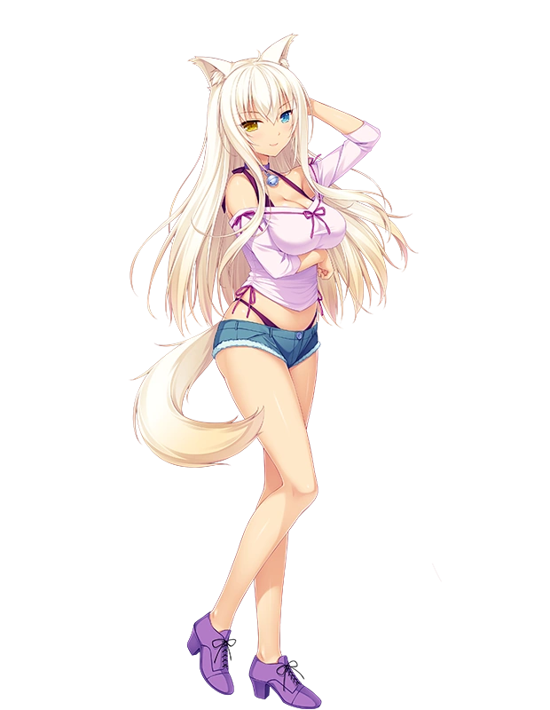

<pre>
👶 15 y.o. developer with 4 year coding experience 👶
🐍 Creating bots and backend using python 🐍
🏔️ Creating simple websites using Nuxt and Vue 🏔️
🦿 Animating in Blender 🦿
📖 Learning Java for future projects 📖
🪟 Using Windows • Linux • Android 🪟
</pre>
 

 

<!-- (innng github readme used as reference, thx) -->
