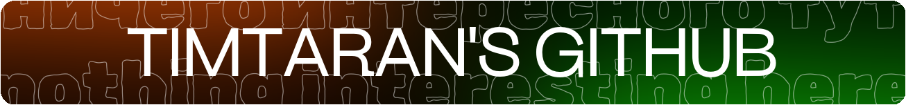

<pre>
👶 16 y.o. dev with 6 years of shit-coding and 0 years of coding experience 👶
🐍 Creating bots and backend using Python 🐍
🍵 Creating Minecraft mods using Java 🍵
🦿 Animating in Blender 🦿
🪟 Using Linux • Windows • Android 🪟
</pre>
 

  My open-source projects:
- [Disable Elytra Outside The End](https://github.com/Timtaran/disable-elytra-outside-the-end) - Minecraft mod that does what says in name
- [demotivator-bot](https://github.com/Timtaran/demotivator-bot) - simple Telegram bot to create komarubot-like demotivators
- [Simple Model Engine](https://github.com/Timtaran/sme) - PaperMC plugin to create animated scenes using custom models with add-on support in mind, abandobed due to parent project cancellation, but may be helpful for someone as half-finished prototype + [blender extension](https://github.com/Timtaran/sme-blender) (also prototype)

<!-- (innng github readme used as reference, thx) -->
